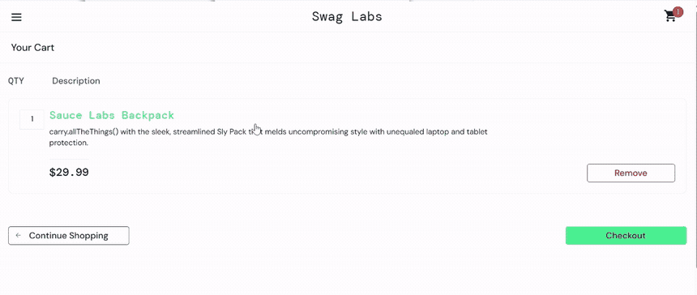
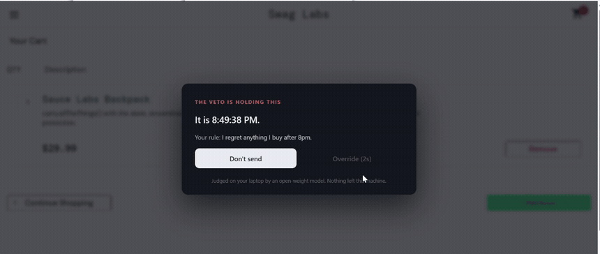
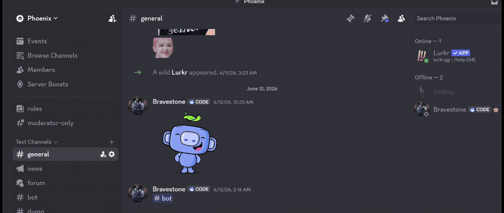

# The Veto

**A local open-weight model whose only job is to stop you.**

Every AI tool in your life is trying to help you do the thing. This one is the
only one trying to stop you, and it runs entirely on your own laptop, because
a tool that reads what you are about to say, *before you say it*, has no
business being an API call.

Built for the [Hacktoberfest Weekend Challenge: Build for a Friend](https://dev.to/challenges/hacktoberfest-weekend-2026-10-01).



*A real checkout, stopped by a rule he wrote himself. Judged by gemma3:4b on
the same laptop. Nothing left the machine.*

Then the part that makes it more than a nag: you can always override it, and
afterwards it asks whether you regretted it. That answer is the only training
signal in the system.



It works the same on anything you type. One message held with the rule quoted
back, the next one straight through, seconds apart. A Veto that stops
everything is a Veto nobody keeps.



---

## The problem

The messages you regret are never the ones you thought about. They are the ones
you sent in the four seconds between feeling something and pressing Enter.

Autocorrect catches typos. Nothing catches intent. And the thing you would need
to catch it (a model reading every draft, every cart, every late-night reply
before it leaves your hands) is precisely the thing you would never hand to
someone else's server.

So it has to be open, and it has to be local. Not as a feature. As the only
version of this that can exist at all.

## What it does

You write rules about yourself **when you are calm**. Not policies. Just sentences,
in your own words:

> *I regret messages where I drag up things from months ago.*
> *I regret anything I buy after 1am.*
> *I regret replying to her within five minutes of reading it.*

Later, in the moment, the Veto sits between you and the send button. A local
model reads the draft, checks it against **your own rules and nothing else**,
and returns one of three things.

| Verdict | What happens |
| --- | --- |
| **PASS** | Trips none of your rules. It gets out of the way. You never see it. |
| **HOLD** | Trips a rule. The send is blocked and a countdown starts. Your own sentence is quoted back at you. |
| **ASK** | Trips a rule only you can resolve. It asks you one question, in your framing, and you must answer before the override unlocks. |

It will not help you. It cannot rewrite your message, soften it, or suggest a
better version. Everything an assistant normally offers is removed from the
system prompt on purpose. It has three things it may say, and "here, let me fix
that for you" is not among them.

## The part that makes it more than a nag

You can always override it. That is the point: a gate you cannot open is a gate
you tear off the wall.

But every override is recorded, and **later, the Veto asks you whether you
regretted it.** That answer is the only training signal in the system, and it is
the one signal that cannot be faked, bought, or scraped: your own hindsight
about your own behaviour.

Rules get harsher where you were wrong, and stay out of your way where you were
right:

```
fresh rule, never overridden         ->  30s hold
overridden once, no regret           ->  45s hold
overridden 4x, regretted 3 of them   -> 293s hold
```

Two deliberate constraints on that:

- **The model classifies. It never sets the penalty.** A 4B model has no
  business deciding how long to lock you out of your own phone. It names which
  rule was tripped; the hold length is a pure function of your override and
  regret history. That number is the one thing in the loop you cannot argue
  with, because you wrote it yourself, one override at a time.
- **The gate fails open.** If the daemon is down, the model crashes, or
  inference times out, your message goes through. A gate that jams shut is one
  you uninstall by Tuesday, and then it protects you from nothing forever.

## Why open matters here

This is the rare project where "why not just call an API?" has a one-sentence
answer: *because then every half-written, furious, 2am draft you never sent
would be on somebody else's disk.*

The drafts the Veto reads are, by construction, the things you most want
unsaid. They are not your published thoughts. They are the ones you thought
better of. An open-weight model running on loopback is not a privacy *feature*
bolted onto this idea. It is the only configuration in which a reasonable
person would ever install it.

Three things follow from being open that a closed API could not give:

1. **No draft ever leaves the machine.** Not in a prompt, not in a trace, not in
   a retention window. The daemon binds to `127.0.0.1` and makes no outbound
   request, ever.
2. **No one else can change the rules.** Your rulebook is a JSON file you own.
   Nobody ships an update that quietly decides what you should be stopped from
   saying.
3. **It costs nothing to run, so it can run on everything.** A gate that bills
   per draft is a gate you turn off on the night you need it.

## Architecture

```
  Chrome extension                Local daemon (127.0.0.1:4777)
  ┌────────────────┐              ┌──────────────────────────┐
  │ generic send   │  draft       │ judge.js  ── adversarial │
  │ interceptor    │ ───────────► │             system prompt│
  │                │              │     │                    │
  │ overlay:       │ ◄─────────── │     ▼                    │
  │ HOLD / ASK     │  verdict     │  Ollama · gemma3:4b      │
  └────────────────┘              │     │                    │
                                  │     ▼                    │
                                  │ store.js ── rules,       │
                                  │   stops, overrides,      │
                                  │   regret history         │
                                  └──────────────────────────┘
                                         no outbound network
```

**The interceptor is deliberately not built on per-site selectors.** WhatsApp, X
and Gmail rename their DOM constantly, and a gate that breaks silently is worse
than no gate, because you keep trusting it after it has stopped working. Instead it
hooks the two gestures that cannot change: Enter inside a composer, and a click
on something shaped like a commit button. One code path, every site.

## Run it

Needs [Ollama](https://ollama.com) and Node 20+.

```bash
ollama pull gemma3:4b
npm install
npm start                 # http://127.0.0.1:4777
```

Then load the extension: `chrome://extensions` → Developer mode → **Load
unpacked** → select `extension/`.

Write a rule or two in the dashboard first. The Veto cannot stop anything until
you have told it what you regret.

```bash
npm run check             # guard + store. No model, no server, instant.
npm run check:e2e         # rule → stop → override → regret → harsher hold
                          #   (needs the daemon running on an EMPTY store)
npm run check:model       # does the real model hold the line? (~90s)
npm run check:stability   # same draft, N runs, same verdict? (~4min)
```

## What it actually does on real hardware

Measured on an i5-8350U, no GPU, 100% CPU inference, on a 2017 ultrabook.

| | |
| --- | --- |
| prompt speed | 21.7 tok/s |
| generation speed | 7.7 tok/s |
| verdict, cold (while you type) | ~23s |
| **verdict at the Enter press** | **0.31s** |
| determinism | 12/12 identical verdicts at `temperature: 0` |
| `gemma3:4b` behaviour checks | 4/4 |
| `gemma3:1b` behaviour checks | 1/4, too small for this task |

The gap between those last two rows is the whole reason the grounding guard
exists. On the 1B run the guard caught **4 out of 4** bad outputs and turned
every one into a PASS: the model was wrong constantly and the product was still
correct, just useless. That is the property worth having when you cannot
guarantee the model.

### Known limitations

- **Rules about tone can be missed.** If the model quotes the whole draft and
  the draft shares no vocabulary with the rule, there is nothing to corroborate
  with and the stop is dropped. Fails open: a missed stop, never a false one.
- **Rule IDs are load-bearing.** They are generated from the rule's own words
  because an opaque ID measurably degrades the model's judgement. See the
  writeup. Editing them by hand in `data/veto.json` is a bad idea.
- **One rule is worse than four.** With a single rule the model feels obliged to
  use it. The guard catches the resulting false stops, but a realistic rulebook
  behaves better.

### Demo mode

```bash
VETO_DEMO=1 npm start
```

**This is keyword matching, not a model.** It exists only so the hosted demo can
be clicked by someone without a GPU. Every claim in this README about model
behaviour refers to `gemma3:4b` running locally, which is what you get when you
run it normally.

## Configuration

| Variable | Default | Meaning |
| --- | --- | --- |
| `VETO_MODEL` | `gemma3:4b` | any Ollama open-weight model |
| `OLLAMA_HOST` | `http://127.0.0.1:11434` | where Ollama listens |
| `VETO_DATA` | `./data/veto.json` | your rulebook and history |
| `PORT` | `4777` | daemon port |
| `VETO_DEMO` | unset | `1` for the keyword stub |

## What it does not do

- It does not read anything you have already sent. Only drafts, only at the
  moment you try to commit them.
- It stores a **140-character excerpt** of a stopped draft so you can recognise
  it in the history, never the full text.
- It has no opinion about whether your message is rude, unwise, or expensive. If
  it trips none of *your* rules, it passes. It is not a safety filter and it is
  not a content policy. It is your own hindsight, wired to the send button.

## License

MIT.
